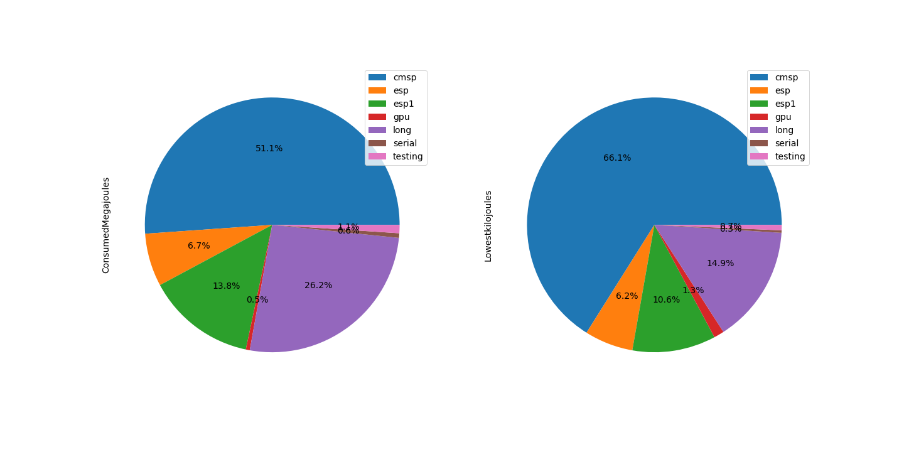

# Argo energy analysis – from 06/03/2020 to 13/03/2020

## Introduction
We activated energy recording plugin in Slurm which is called the RAPL. RAPL measures energy for CPU and DRAM only.  The period of measurement was approximately a week starting from 06/03/2020 to 13/03/2020. Argo is a heterogeneous cluster with nodes from different architectural family.  When we configured the monitoring tool, the nodes needed to be restarted and this somehow gave us the variable to use to measure the time when this was running.

Command used to get the `scontrol show node  -o `

The logical steps for preparation of the report on files:

* For Energy Analysis [Energy analysis ](energy_processing_con.ipynb)
* For Power Analysis [Power analysis ](power_processing.ipynb)

## Energy 

### Node states
State of the cluster (Argo) when the statistics was acquired:
* We have 2 nodes (nehalem[01-02])were not collecting data at all.
* All other nodes recorded normal readings except
* The following nodes had additional reason attribute from the rest of the nodes in the cluster at the time of data extraction from Slurm

| Node Name        | State         | Reasons  |
| -------------    |:-------------:| --------:|
| Node103          | IDLE+DRAIN    | Node crashes frequently |
| Node93           | IDLE+DRAIN    |  openib RETRY EXCEEDED ERROR |
| Node109          | IDLE+DRAIN     |  batch job complete failure |
| Node132          | IDLE+DRAIN     |    HD problems |
| Node133          | IDLE+DRAIN      |    Low RealMemory |
| Node134          | IDLE+DRAIN      |    Error |
| Serial02         | DOWN+POWER      |    ResumeTimeout reached |
| Westmere01       | IDLE+DRAIN+POWER   |    Low RealMemory |

            Table 1.1  States of unusual nodes

### Energy reading per partition 
The table 1.1 shows the consumed Mega-joules(Mj) per partition and the lowest-Kilo-joules (kj). It can be noted that CMSP partition uses most of the energy followed by the long partition and GPU partition having the lowest energy. In addition to that GPU nodes have high Lowestkilojoules considering that they are just 2 nodes which is expected.

            Table 1.2 Energy statistics per partition

|Partitions|ConsumedMegajoules|Lowestkilojoules|
|----------|------------------|----------------|
|cmsp      |3713.95           |21143.11        |
|esp       |488.6             |1973.29         |
|esp1      |1005.4            |3388.78         |
|gpu       |36.63             |417.39          |
|long      |1903.4            |4763.26         |
|serial    |42.15             |99.78           |
|testing   |76.34             |219.33          |

            

            Fig 1.0 Energy consumption per partition

            

According to figure 1.0, shows graphical presentation of consumed-joules and lowest-kilojoules of data that is in table 1.1.

### Energy reading per feature 
The energy consumed categorised by feature:

            Table 1.3 Energy statistics per partition

|Partitions|AvailableFeatures                     |ConsumedMegajoules|Lowestkilojoules|
|----------|--------------------------------------|------------------|----------------|
|cmsp      |omnipart,128gb,broadwell-ep,e5-2640v4 |1440.93           |8533.63         |
|cmsp      |omnipart,192,broadwell-ep,e5-2640v4   |2273.02           |12609.48        |
|esp       |infiniband,32gb,sandybridge-ep,e5-2620|476.25            |1924.83         |
|esp       |infiniband,64gb,ivybridge-ep,e5-2680v2|12.35             |48.46           |
|esp1      |infiniband,64gb,ivybridge-ep,e5-2680v2|1005.4            |3388.78         |
|gpu       |128gb,broadwell-ep,e5-2640v4          |14.46             |327.9           |
|gpu       |32gb,sandybridge-ep,e5-2665           |22.18             |89.49           |
|long      |infiniband,32gb,sandybridge-ep,e5-2620|264.43            |1511.23         |
|long      |infiniband,32gb,sandybridge-ep,e5-2650|200.82            |1214.86         |
|long      |infiniband,64gb,ivybridge-ep,e5-2680v2|1438.15           |2037.17         |
|serial    |32gb,sandybridge-ep,e5-2650           |42.15             |99.78           |
|testing   |32gb,sandybridge-ep,e5-2650           |76.34             |219.33          |

#### Distribution for nodes per partition

### Analysis per partition 

### Feature distribution on the cluster

|AvailableFeatures|ConsumedMegajoules|Lowestkilojoules|
|-----------------|------------------|----------------|
|128gb,broadwell-ep,e5-2640v4|14.46             |327.9           |
|32gb,sandybridge-ep,e5-2650|118.49            |319.11          |
|32gb,sandybridge-ep,e5-2665|22.18             |89.49           |
|infiniband,32gb,sandybridge-ep,e5-2620|740.68            |3436.06         |
|infiniband,32gb,sandybridge-ep,e5-2650|200.82            |1214.86         |
|infiniband,64gb,ivybridge-ep,e5-2680v2|2455.9            |5474.41         |
|omnipart,128gb,broadwell-ep,e5-2640v4|1440.93           |8533.63         |
|omnipart,192,broadwell-ep,e5-2640v4|2273.02           |12609.48        |

#### CSMP Partition 

|AvailableFeatures|ConsumedMegajoules|Lowestkilojoules|
|-----------------|------------------|----------------|
|omnipart,128gb,broadwell-ep,e5-2640v4|1440.93           |8533.63         |
|omnipart,192,broadwell-ep,e5-2640v4|2273.02           |12609.48        |

#### Long Partition

|AvailableFeatures|ConsumedMegajoules|Lowestkilojoules|
|-----------------|------------------|----------------|
|infiniband,32gb,sandybridge-ep,e5-2620|264.43            |1511.23         |
|infiniband,32gb,sandybridge-ep,e5-2650|200.82            |1214.86         |
|infiniband,64gb,ivybridge-ep,e5-2680v2|1438.15           |2037.17         |

#### GPU Partition 

|AvailableFeatures|ConsumedMegajoules|Lowestkilojoules|
|-----------------|------------------|----------------|
|128gb,broadwell-ep,e5-2640v4|14.46             |327.9           |
|32gb,sandybridge-ep,e5-2665|22.18             |89.49            |

#### CSMP Partition 

|AvailableFeatures|ConsumedMegajoules|Lowestkilojoules|
|-----------------|------------------|----------------|
|omnipart,128gb,broadwell-ep,e5-2640v4|1440.93           |8533.63         |
|omnipart,192,broadwell-ep,e5-2640v4|2273.02           |12609.48        |

##### All other partitoions serial, test, long 

## Power 

