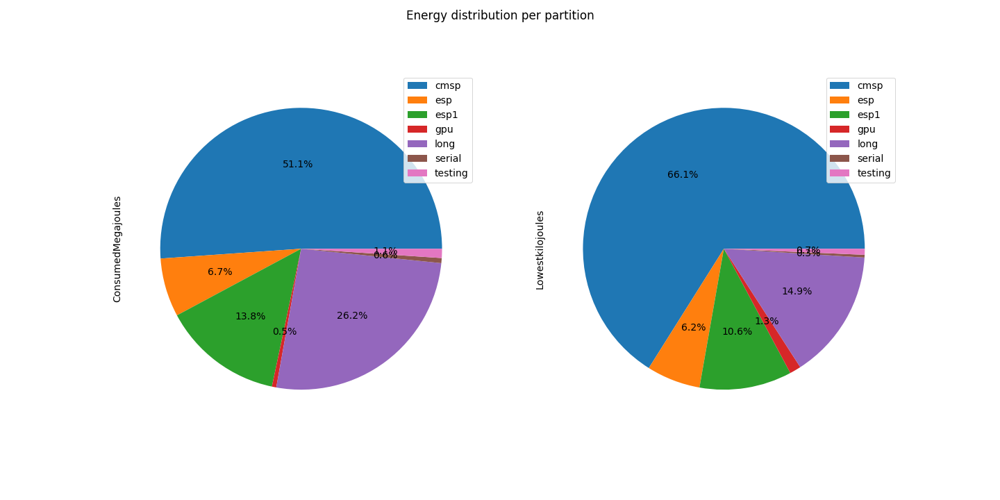
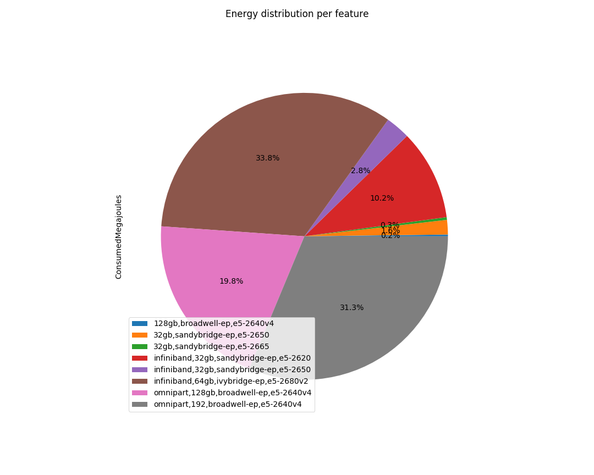
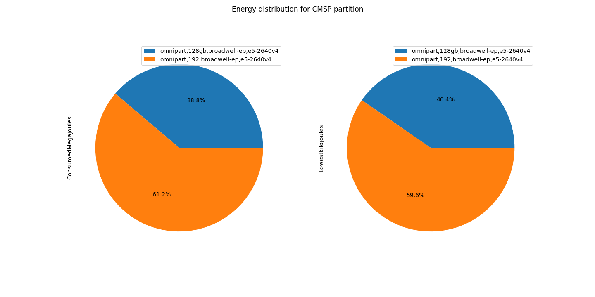
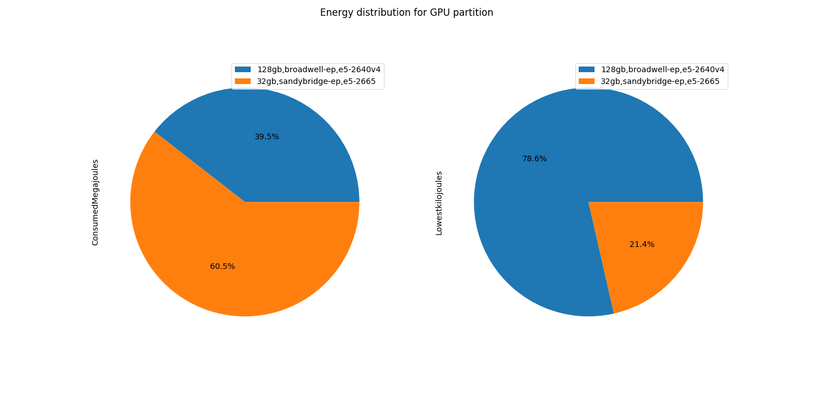

# Argo energy analysis – from 06/03/2020 to 13/03/2020

## Introduction
Argo is a heterogeneous cluster with nodes from different architectural family. Our aim is to measure and  understand energy utilisation of the cluster in order to implement energy saving measures. We activated energy recording plugin RAPL in Slurm, which is used to measure enegergy for CPU and DRAM only. The period of measurement was approximately a week starting from 06/03/2020 to 13/03/2020.After configuring the monitoring tool, we restarted nodes and this gave us an additional variable SlurmdStartTime to use to measure the time when the enegergy  started being recorded.

Command used to get the `scontrol show node  -o `

### Node states
The results from the command shows that we have 151 nodes and not all of them were recording enegery. Below is a brief summary of the nodes: 
* We have 2 nodes(nehalem[01-02]) that were not collecting data.
* We have additional 2 nodes westmere01 and serial02 that also were not  making any recording.In addition to this  I also noticed that NodeHostName was a number I am not sure if this is the issue and Node `westmere01` had `23938` and `serial02` had `31955`
* Apart from the 4 nodes  mentioned above all other nodes recorded normal readings. Nodes in table 1.0  had  an additional `Reason Attribute` from the rest of the nodes in the cluster at the time of data extraction from Slurm but I captured thier energy.

| Node Name        | State         | Reasons  |
| -------------    |:-------------:| --------:|
| Node103          | IDLE+DRAIN    | Node crashes frequently |
| Node93           | IDLE+DRAIN    |  openib RETRY EXCEEDED ERROR |
| Node109          | IDLE+DRAIN     |  batch job complete failure |
| Node132          | IDLE+DRAIN     |    HD problems |
| Node133          | IDLE+DRAIN      |    Low RealMemory |
| Node134          | IDLE+DRAIN      |    Error |
| Serial02         | DOWN+POWER      |    ResumeTimeout reached |
| Westmere01       | IDLE+DRAIN+POWER   |    Low RealMemory |

Table: 1.0  Unusual state of nodes

## Energy 
The logical steps for preparation of the report on files:

* For Energy Analysis [Energy analysis ](energy_processing_con.ipynb)
* For Power Analysis [Power analysis ](power_processing.ipynb)

### Energy reading per partition 
The table 1.1 shows the consumed Megajoules(Mj) and the lowest Kilojoules (kj) per partition. It can be noted that CMSP partition uses almost half of the energy followed by the long partition and GPU partition having the lowest energy. In addition to that GPU nodes have high Lowestkilojoules considering that they are just 2 nodes which is expected. 

|Partitions|ConsumedMegajoules (Mj)|Lowestkilojoules (kj)|
|----------|------------------|----------------|
|cmsp      |3713.95           |21143.11        |
|esp       |488.6             |1973.29         |
|esp1      |1005.4            |3388.78         |
|gpu       |36.63             |417.39          |
|long      |1903.4            |4763.26         |
|serial    |42.15             |99.78           |
|testing   |76.34             |219.33          |

Table: 1.1 Energy per partition

The total energy that was consumed by the nodes is 7266.47 Megajoules.
            
 
Fig 1.0 Energy Consumption per partition

According to figure 1.0, shows graphical presentation of consumed-joules and lowest-kilojoules of data that is in table 1.1.

### Energy reading per feature 
The energy consumed categorised by feature:

|Partitions|AvailableFeatures                     |ConsumedMegajoules (Mj)|Lowestkilojoules (kj) |Num Nodes |
|----------|--------------------------------------|------------------|----------------|----------|
|cmsp      |omnipart,128gb,broadwell-ep,e5-2640v4 |1440.93           |8533.63         |  24      |
|cmsp      |omnipart,192,broadwell-ep,e5-2640v4   |2273.02           |12609.48        |  16      |
|esp       |infiniband,32gb,sandybridge-ep,e5-2620|476.25            |1924.83         |  35      |
|esp       |infiniband,64gb,ivybridge-ep,e5-2680v2|12.35             |48.46           |  1       |
|esp1      |infiniband,64gb,ivybridge-ep,e5-2680v2|1005.4            |3388.78         |  28      |
|gpu       |128gb,broadwell-ep,e5-2640v4          |14.46             |327.9           |  1      |
|gpu       |32gb,sandybridge-ep,e5-2665           |22.18             |89.49           |  1      |
|long      |infiniband,32gb,sandybridge-ep,e5-2620|264.43            |1511.23         |  16     |
|long      |infiniband,32gb,sandybridge-ep,e5-2650|200.82            |1214.86         |  12     |
|long      |infiniband,64gb,ivybridge-ep,e5-2680v2|1438.15           |2037.17         |  10     |
|serial    |32gb,sandybridge-ep,e5-2650           |42.15             |99.78           |  1      |
|testing   |32gb,sandybridge-ep,e5-2650           |76.34             |219.33          |  2      | 

Table: 1.3 Energy per partition grouped by features 

Table 1.3 shows the the energy of partitions and further classfied by different types of architecture that is make up the  parttions.

#### Distribution for nodes per partition

### Analysis per partition 

### Feature distribution on the cluster

|AvailableFeatures|ConsumedMegajoules (Mj)|Lowestkilojoules (kj) |Num Nodes |
|-----------------|------------------|----------------|---------- |
|128gb,broadwell-ep,e5-2640v4|14.46             |327.9           | 1  |
|32gb,sandybridge-ep,e5-2650|118.49            |319.11          | 3 |
|32gb,sandybridge-ep,e5-2665|22.18             |89.49           | 1  |
|infiniband,32gb,sandybridge-ep,e5-2620|740.68            |3436.06         |47 |
|infiniband,32gb,sandybridge-ep,e5-2650|200.82            |1214.86         |10  |
|infiniband,64gb,ivybridge-ep,e5-2680v2|2455.9            |5474.41         | 45  |
|omnipart,128gb,broadwell-ep,e5-2640v4|1440.93           |8533.63         |16  |
|omnipart,192,broadwell-ep,e5-2640v4|2273.02           |12609.48        |24  |

Table: 1.4 Energy  per feature

#### CSMP Partition 

|AvailableFeatures|ConsumedMegajoules|Lowestkilojoules|Num Nodes |
|-----------------|------------------|----------------|-----------|
|omnipart,128gb,broadwell-ep,e5-2640v4|1440.93           |8533.63         |  16 |
|omnipart,192,broadwell-ep,e5-2640v4|2273.02           |12609.48        |  24 |

#### Long Partition

|AvailableFeatures|ConsumedMegajoules|Lowestkilojoules|Num Nodes  |
|-----------------|------------------|----------------|----------- |
|infiniband,32gb,sandybridge-ep,e5-2620|264.43            |1511.23         |  12  |
|infiniband,32gb,sandybridge-ep,e5-2650|200.82            |1214.86         |  10  |
|infiniband,64gb,ivybridge-ep,e5-2680v2|1438.15           |2037.17         | 16   |

#### GPU Partition 

|AvailableFeatures|ConsumedMegajoules|Lowestkilojoules|Num Nodes  |
|-----------------|------------------|----------------|----------- |
|128gb,broadwell-ep,e5-2640v4|14.46             |327.9           |  1  |
|32gb,sandybridge-ep,e5-2665|22.18             |89.49            |  1  |

#### ESP Partition 

|AvailableFeatures|ConsumedMegajoules|Lowestkilojoules|Num Nodes  |
|-----------------|------------------|----------------|----------- |
|infiniband,32gb,sandybridge-ep,e5-2620|476.25            |1924.83         |   35   |
|infiniband,64gb,ivybridge-ep,e5-2680v2|12.35             |48.46           |    1  |

##### All other partitoions serial, test, esp have one family  they are  using. 

 

